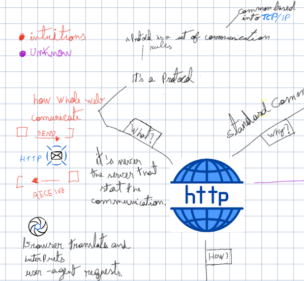
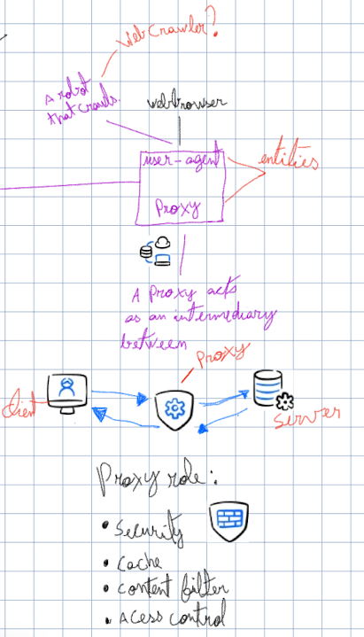
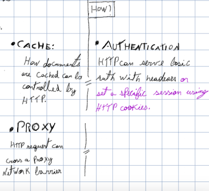
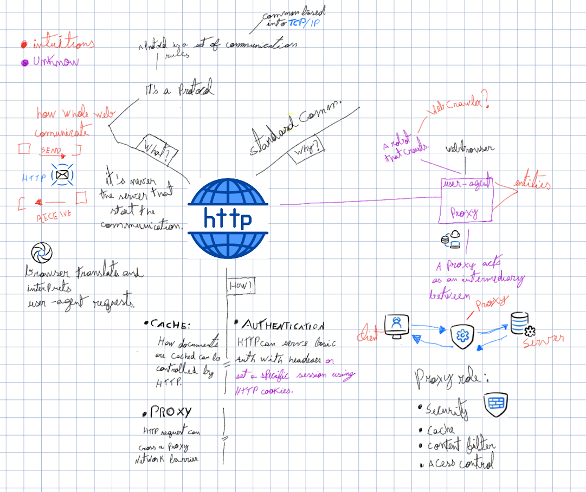

---

#### what?

#### why?

WIP

### proxy

#### how?

#### the big picture

#### references

- https://en.wikipedia.org/wiki/Proxy_server
- https://developer.mozilla.org/en-US/docs/Web/HTTP/Overview#components_of_http-based_systems
- [Google Gemini](https://gemini.google.com/?hl=pt-BR)
