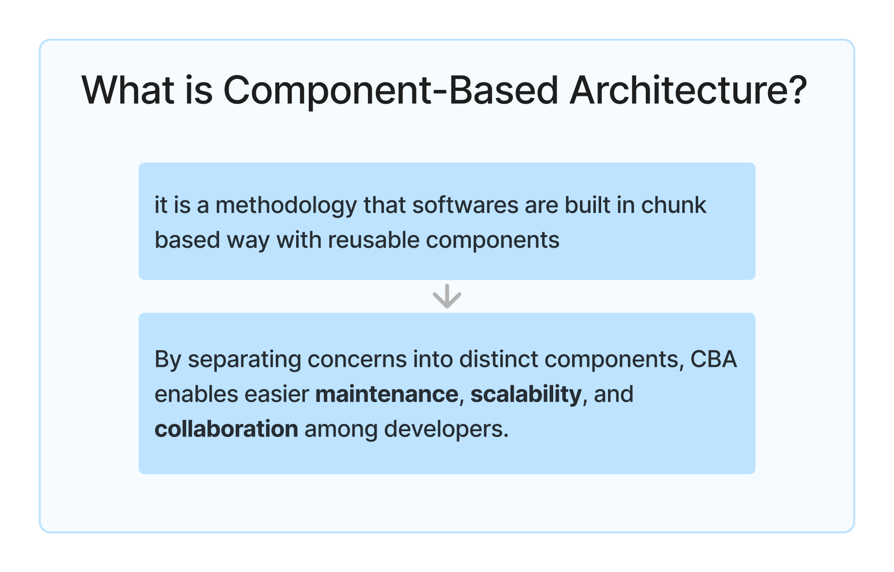
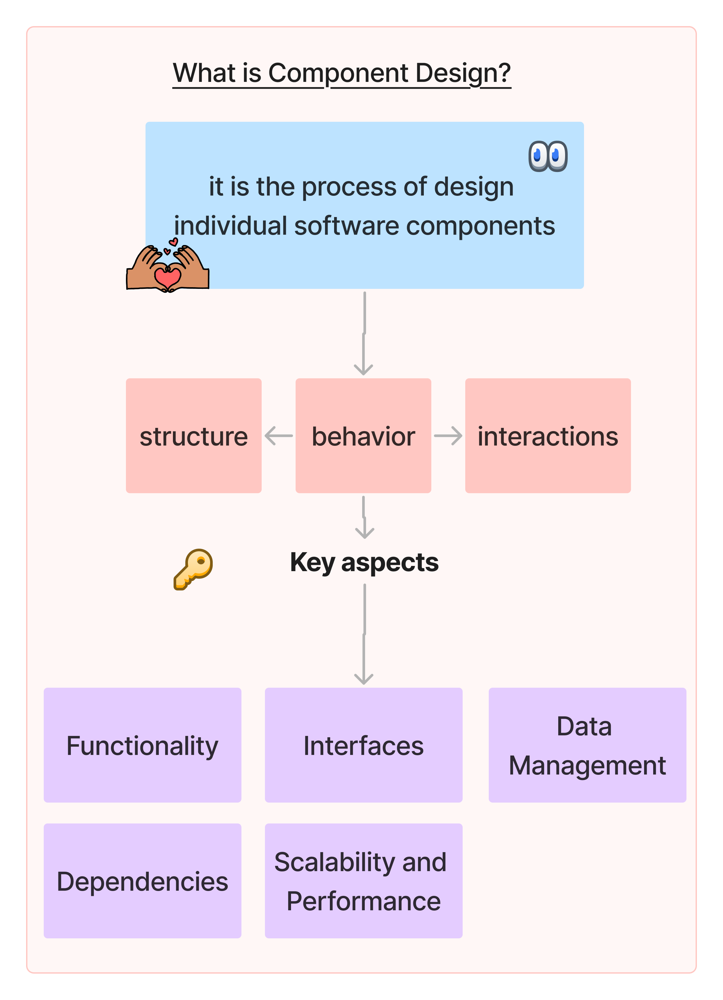
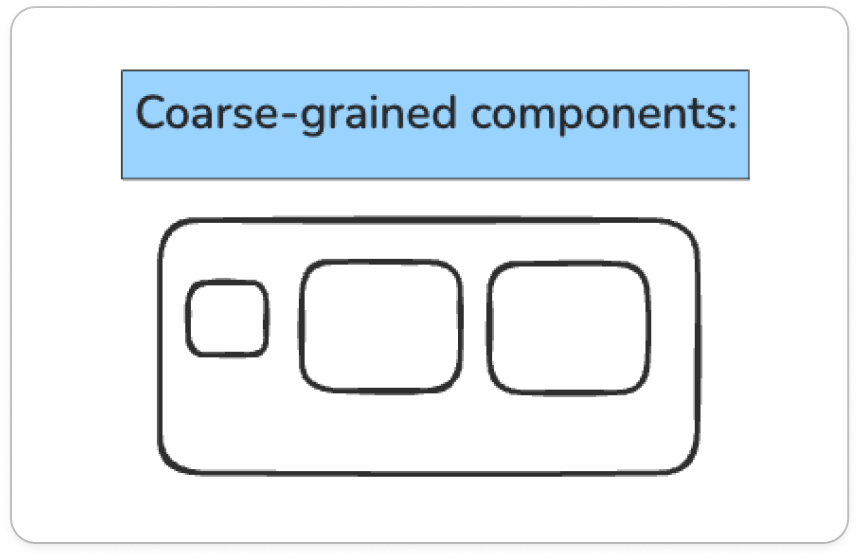
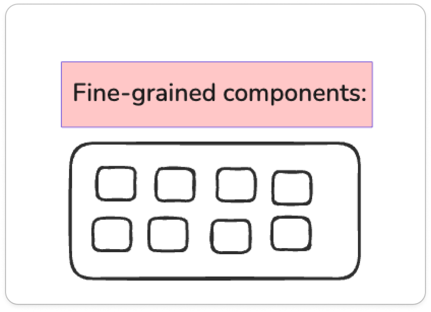

---
### What is component-based architecture?

### What is component design?

>[!example]  coarse-grained components vs fine-grained components:

|                                                 |                             |
| ----------------------------------------------- | --------------------------- |
|  |  |
|                                                 |                             |

### Communication Between Components

#### Design Principles

#### references
* https://www.geeksforgeeks.org/what-is-component-design/
* https://www.geeksforgeeks.org/component-based-architecture-system-design/
* Gemini 🤖

