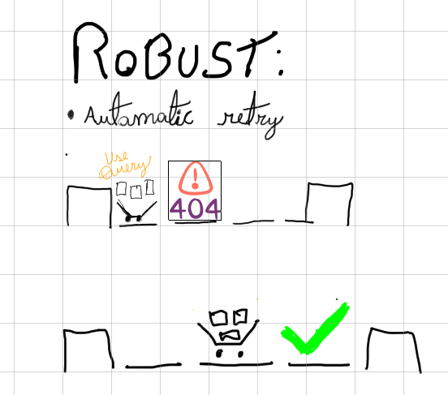
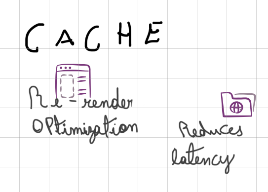

 
---

 ### ❌ PROBLEMS:
* Data inconsistency
* Potential security risks
* Fetch data manually(`useEffect` and `state`)
* Lack of consistent cache handle.

#### what solves this problem?
* react query library
#### why?

* ==more robust==
* ==streamlined approach==
* ==mitigating security risks==

#### how?

|  |  |  |
| -------------------------------------- | -------------------------------------- | -------------------------------------- |

