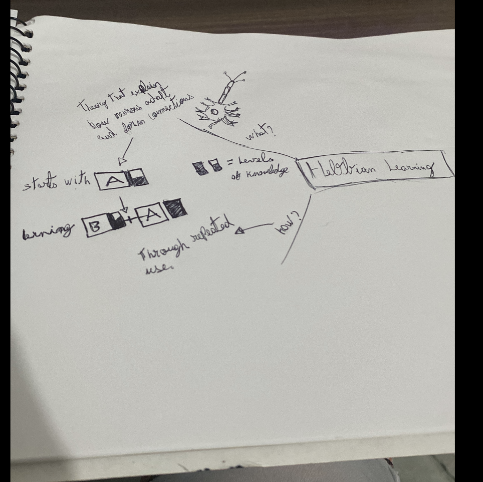

---

#### what ?

> "neurons that fire together, wire together."

#### why?
to my context, it just an explanation theory that reinforces the idea 
of making coding feel more natural and efficient with regular practice.

#### how?

>Engage in regular coding challenges or projects. Repetition helps reinforce neural connections, improving your ability to recognize patterns and solve complex problems.

#### references

- [Wikipedia - Hebbian Learning](https://en.wikipedia.org/wiki/Hebbian_theory "null")
- [The Decision Lab - Hebbian Learning](https://thedecisionlab.com/insights/psychology/hebbian-learning "null")

